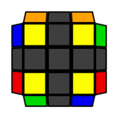

  

# 四角归位

这步将顶层的四个角块的相对位置也还原正确。

观察顶面的四个侧面，有两种可能的情况：

## 一侧的角块颜色相同

 &emsp;&emsp;&emsp;

 如图所示，一个侧面的角块颜色相同，其余三个侧面的颜色不同。这里画出的是橙色相同。

 `Ux`将角块颜色相同的侧面转向左侧，然后完成公式：

 **公式三** `(R U R' U') R' F (R2 U' R' U') (R U R' F')`

 

如果你在上一节只记忆了公式〇（`R' U L U' R U L'`），并不打算记新的公式，那么`Ux`将角块颜色相同的侧面转向后侧，然后完成：

 `L F (公式〇) U' F' L'`

  

## 每侧的角块颜色不同

 &emsp;&emsp;&emsp;

 如图所示，任何一侧的角块颜色都不同。此时每一侧都是等价的，因此无需做方向调整。
 
 可以叠加公式三解决：执行一次公式三（或是`L F (公式〇) U' F' L'`），使之变为上一种情形。

   

一步复原公式为：

**进阶公式六** `F (R U' R' U') (R U R' F') (R U R' U') (R' F R F')`

   

