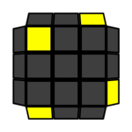
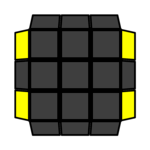
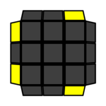

 

# 四角色向
 
 这步要将顶层的四个角块在顶层上的颜色还原正确，也就是黄色一致朝上。
 
 

 
 

 
 共有7种未还原的情形。根据顶层四角的位置上已还原的黄色面的数量，将其分为3类：
 
 ## 一个黄色面已还原
 
 ### As
 
 &emsp;&emsp;&emsp;
 
 上图为As形态的俯视图，特点是3个未复原的黄色面都在对应角块的右侧。换句话说，将角块逆时针旋转120°，可以把黄色面移动到顶层。使用公式前，通过`Ux`将已复原的黄色面放在俯视图的左上角。
 
 **公式一** `R' U' R U' R' U2 R`
 
 

 
 

 
 这个公式的组成为：`(基本操作二) U' (基本操作二)`。（见[基本操作二](./../两桥/右桥.md#基本操作二r-ux-r)）可以看出，它先将右桥的后棱角对移动到顶层，再换一种方式重新插入。
 
 如果你只想为整个CMLL步骤记忆一条公式，那么记忆下面的公式：
 
 **公式〇** `R' U L U' R U L'`
 
 

 
 

 
 ### S
 
 &emsp;&emsp;&emsp;
 
 S形态的特点是3个未复原的黄色面都在对应角块的左侧。使用公式前，通过`Ux`将已复原的黄色面放在俯视图的左下角。
 
 **公式二** `R U R' U R U2 R'`
 
 

 
 

 
 这个公式的组成为：`(基本操作一) U (基本操作一)`。（见[基本操作一](./../两桥/右桥.md#基本操作一r-ux-r)）它对右桥的前棱角对完成重新插入。
 
 也可以只使用公式〇。将已复原的黄色面放在俯视图的左上角位置，再完成：
 
 `(公式〇) U' (公式〇)`
 
 

 
 

 
### 叠加法

 除As与S以外的所有形态，都能通过执行一次公式一转化为As或S形态，因此总能通过叠加前面的公式来解决: `Ux (公式一) Ux (公式一/公式二)`。`Ux`用于调整朝向。

 也可以只使用公式〇，因为公式一可以替换为公式〇、公式二可以替换为`(公式〇) U' (公式〇)`。注意中途用于调整朝向的`Ux`可能有一些变化。
 
 ## 两个黄色面已还原
 
 恰好两个黄色面已还原的情形有3种。其叠加法如下：无论哪种情形，保证俯视图中左上角的角块是黄色朝上的:
 
 &emsp;&emsp;&emsp;
 
 然后使用公式一，就一定转为S形态，从而能够通过公式二解决。
 
 下面的T形态中，给出了叠加法的一个具体例子。
 
 ### T
 
 T形态中，两个未还原的角块相邻，黄色面方向相对。
 
 &emsp;&emsp;&emsp;
 
 采用叠加法时，首先保证俯视图中左上角的角块黄色朝上，上图已满足要求。然后，执行公式一。`U2`调整朝向后，再做公式二。
 
 

 
 

 
 T形态复原公式：
 
 **进阶公式一** `(R U R' U') (R' F R F')`
 
 

 
 

 
 ### U
 
 U形态中，两个未还原的角块也相邻，但黄色面方向相同。
 
 &emsp;&emsp;&emsp;
 
 采用[叠加法](#两个黄色面已还原)时，上图的朝向满足起手要求。
 
 U形态复原公式：
 
 **进阶公式二** `F (R U R' U') F'`
 
 

 
 

 
 起手时，两个黄色面朝左，与叠加法的起手是不同的。

### L

L形态中，两个未还原的角块相对。

 &emsp;&emsp;&emsp;
 
 采用[叠加法](#两个黄色面已还原)时，上图的朝向满足起手要求。

 L形态复原公式：
 
 **进阶公式三** `(F R' F' R) (U R U' R')`
 
 

 
 

 起手时，俯视图中左下角的黄色面朝下。

  ## 零个黄色面已还原
 
 所有的黄色面都未还原的情形有2种。其[叠加法](#叠加法)如下：无论哪种情形，保证俯视图中左侧的两个角块是黄色朝左的:
 
 &emsp;&emsp;&emsp;
 
 然后使用公式一，就一定转为As形态，从而通过公式一解决。
 
 ### H
 
 H形态中，四个未还原黄色面朝向两个方向。

&emsp;&emsp;&emsp;

对于叠加法，首先保证俯视图中左上角的角块黄色朝上，上图已满足要求。

然后，执行两次公式一。这里，中途不需要转动U层调整朝向。
 
 

 
 

 消步后即为H形态的复原公式：

 **进阶公式四** `(R' U' R U') (R' U R U') R' U2 R`

 

 
 

### Pi
 
Pi形态中，四个未还原黄色面朝向三个方向。

&emsp;&emsp;&emsp;

采用[叠加法](#零个黄色面已还原)时，上图的朝向满足起手要求。

Pi形态复原公式：

**进阶公式五** `F (R U R' U')2 F'`

 

 
 

## 叠加法原理（选读）

所有的情形都能通过执行一次As的复原公式（公式一），转化为As或S，也就是恰有一个黄色面已还原的情形。但我们对初始的朝向做了要求，并不是随便做一次公式一就一定能转化。那么，为什么我们提供的朝向就能奏效呢？

以T形态为例。它属于两个黄色面已还原的情形，我们要求俯视图中左上角的角块黄色朝上，然后执行公式一，完成转化。

 &emsp;&emsp;&emsp;

对于As形态，我们要求俯视图的左上角的角块黄色面已复原，然后执行公式一，完成复原。

 &emsp;&emsp;&emsp;

比较这两个俯视图，可以发现除了左下角的角块黄色面都朝下外，其他三个角块的形态都不同。因此同样执行公式一后，也会有三个角块的形态不同。既然执行结束后，As形态的四个黄色面都复原，那么T形态一定转化为恰有一个黄色面已还原，即As或S。你可以对[叠加法](./cmll.md#叠加法)图中左边5个形态的朝向做验证，它们一定恰好有一个角块的形态与As相同。

As形态执行公式一后，不会改变左上角的角块的状态（但会改变位置）。因此T形态执行公式一后，左上角的角块的状态也不会改变，其状态与S形态的三个未复原的角块一致，因此推断出转化为S形态。同理，所有的两个黄色面已还原的情形，都将转化为S形态。