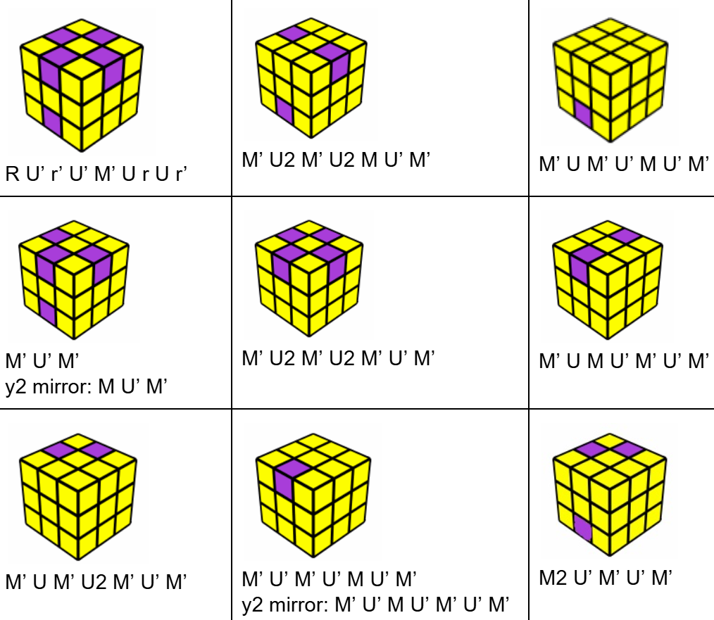

# 后六棱

## 目标

这步的目标是将剩下的6个棱块（以灰色标出）复原，从而复原整个魔方。后六棱又叫做LSE(Last Six Edges)、L6E。

与CMLL类似，我们将后六棱分为两个步骤：

## 一. 后六棱色向

这步(eo/4a)要将顶层和底层上剩余的块的色向还原正确，也就是白色和黄色一致朝上或朝下。下面是一个色向还原的例子。

### 色向复原流程

色向的复原流程如下：（图片作者：甘浩東/Anto Kam）

在这张图中，中心块的色向已经复原；红色棱块代表色向错误的棱块，即白色/黄色面不朝向上/下。

### 色向复原公式

色向直接复原的公式如下：（图片作者：Kian Mansour）

在这张图中，中心块的色向已经复原；紫色棱块代表色向错误的棱块。

无论采用哪一种学习路径，我们都建议结合[色向转换原理](./eo.md#色向转换原理)来辅助理解。

## 二. 后六棱归位

这步要在色向还原的基础上，将剩下的6个棱块彻底复原，从而完成整个魔方的复原。可以细分为左右棱归位(ulur/4b)和后四棱(l4e/4c)。

### 左右棱归位步骤

先将左右面位于顶层的2个棱块复原。先将它们都移动到底层，再插入：

在这张图中，紫色代表要插入的两个棱块，即黄蓝黄绿棱块。

### 后四棱公式

复原M层的最后4个棱块：

后八类情形都属于三个棱块未复原（三棱换）的情形。仅通过观察U层和F层不足以确定其形态，还需要观察D层的形态（图片左侧）。

三棱换的公式不必全部记忆，在对应小节中将介绍一种不依赖转体的理解性的复原方法。另外，利用[x转体](./../记号.md#x-转体)可以将三棱换归为两种情形，即顺时针和逆时针三棱换。

如此就完成了整个魔方的复原。

> 后六棱的两个步骤的具体内容将在以下两节介绍。