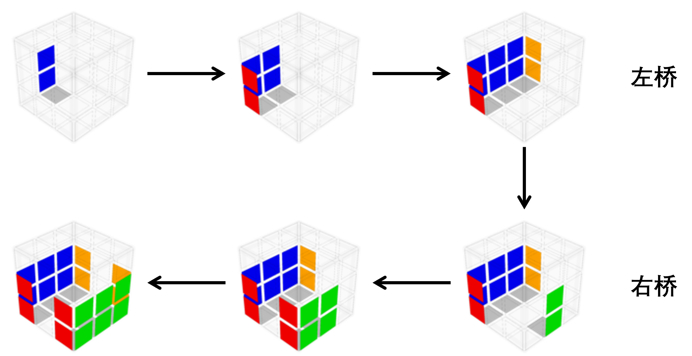

# 两桥

“两桥”指的是左桥和右桥。“桥”指的是一个1×2×3的块，按照摆放的位置区分为左桥和右桥，位置相对。复原顺序是先左桥，后右桥。

以下是一个已经复原好的左右桥：

## 还原步骤

> 如[复原步骤的阅读](./../../简介.md#复原步骤的阅读)所述，这部分为简略复原指引，大致了解即可。你也可以跳过，在后续的章节中再详细学习。

### 复原过程

左右桥的复原过程非常自由。一种可行的复原过程如下：

每个桥的复原都是先完成底层的棱块，再完成两侧的棱块与角块的组合（棱角对）。

### 棱角对复原

棱角对的复原是两桥部分的重点，其复原过程也较为自由。一种可行的复原过程如下：

仅作为示意，实际的情形不必与上述图片完全一致。

左桥棱角对的复原只会比右桥的更简单。对于右桥的另一棱角对，你可以通过镜像的操作来复原。

### 基本操作

在完成右桥时，两类基本操作`R Ux R'`与`R' Ux R`会非常有用：它们涉及与右桥空缺棱角对的位置有关的块的操作。可以将空缺棱角对的位置中的块移出，或是将位于顶层的棱角对放在空缺棱角对的位置中，完成归位。

它们也可以对UFR位或UBR位的角块做翻转，调整角块的朝向。通过这种方法，可以使待复原角块的白色面不朝上。例如：

> 左右桥的具体内容将在以下两节介绍。若上面的简略复原指引已经足以让你理解并复原左右桥，你也可以跳过后面的详细介绍。